# Trie Structure Analysis Report

- **Model**: Qwen/Qwen2.5-3B-Instruct
- **Dataset**: SWE-bench Lite (20 samples)
- **Trie mode**: node_size=1 (original), spec=5
- **Total root entries**: 2,589
- **Total nodes (all trees)**: 95,116

## 1. Depth-Level Overview

### 1.1 Node Count per Depth

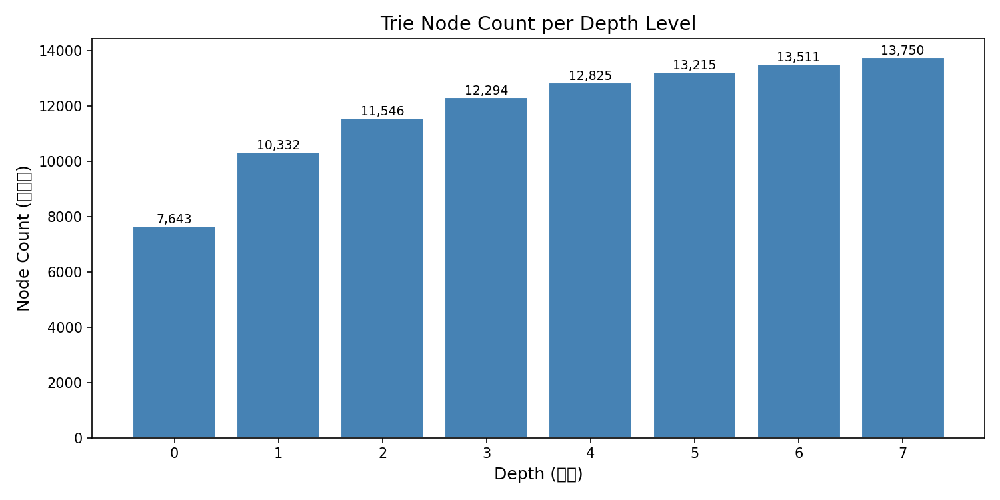

| Depth | Nodes | Unique Tokens | Avg Branching | Median Branching | Avg Freq (mix) |
|-------|-------|---------------|---------------|------------------|----------------|
| 0 | 7,643 | 2,588 | 1.35 | 1.0 | 2.67 |
| 1 | 10,332 | 2,588 | 1.12 | 1.0 | 1.97 |
| 2 | 11,546 | 2,588 | 1.06 | 1.0 | 1.76 |
| 3 | 12,294 | 2,587 | 1.04 | 1.0 | 1.65 |
| 4 | 12,825 | 2,586 | 1.03 | 1.0 | 1.58 |
| 5 | 13,215 | 2,585 | 1.02 | 1.0 | 1.53 |
| 6 | 13,511 | 2,586 | 1.02 | 1.0 | 1.50 |
| 7 | 13,750 | 2,586 | 0.00 | 0.0 | 1.47 |

### 1.2 Branching Factor Distribution

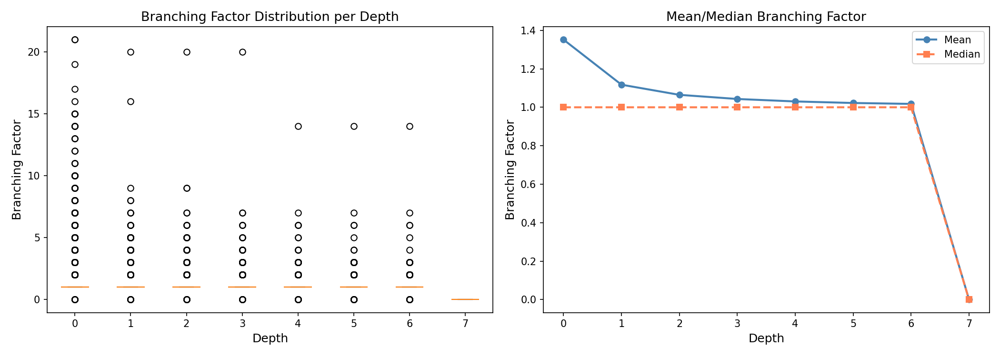

> Branching factor = number of children per node. Higher branching means more diverse continuations.

### 1.3 Frequency Distribution (Input vs Output)

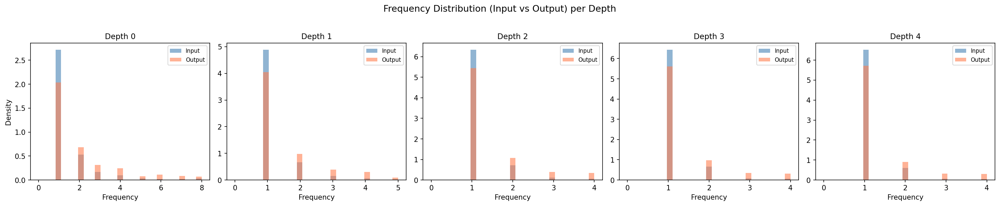

> Input freq: from prompt tokens. Output freq: from generated tokens. Output freq drives draft selection in 'mix' mode.

## 2. Root Token Analysis

### 2.1 Top Root Tokens by Subtree Size

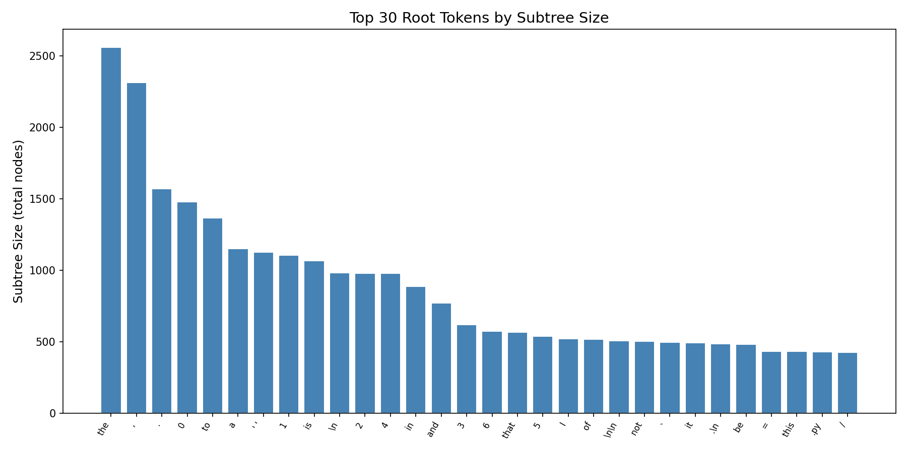

| Rank | Root Token | Token ID | Subtree Nodes | Total Freq |
|------|-----------|----------|---------------|------------|
| 1 | ` the` | 279 | 2,559 | 530 |
| 2 | `,` | 11 | 2,312 | 555 |
| 3 | `.` | 13 | 1,571 | 364 |
| 4 | `0` | 15 | 1,478 | 384 |
| 5 | ` to` | 311 | 1,367 | 251 |
| 6 | ` a` | 264 | 1,153 | 312 |
| 7 | `' '` | 220 | 1,126 | 252 |
| 8 | `1` | 16 | 1,104 | 312 |
| 9 | ` is` | 374 | 1,068 | 191 |
| 10 | `\n` | 198 | 983 | 270 |
| 11 | `2` | 17 | 980 | 254 |
| 12 | `4` | 19 | 978 | 291 |
| 13 | ` in` | 304 | 888 | 178 |
| 14 | ` and` | 323 | 773 | 143 |
| 15 | `3` | 18 | 619 | 213 |
| 16 | `6` | 21 | 573 | 204 |
| 17 | ` that` | 429 | 567 | 111 |
| 18 | `5` | 20 | 538 | 174 |
| 19 | ` I` | 358 | 522 | 179 |
| 20 | ` of` | 315 | 519 | 90 |

### 2.2 Root Subtree Size Distribution

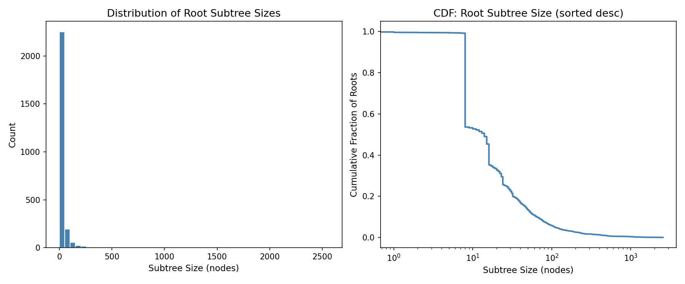

- **Max subtree**: 2,559 nodes
- **Median subtree**: 14 nodes
- **Mean subtree**: 36.7 nodes
- **Roots with 1 node**: 6 (0.2%)
- **Roots with >100 nodes**: 149 (5.8%)

## 3. Token Distribution per Depth

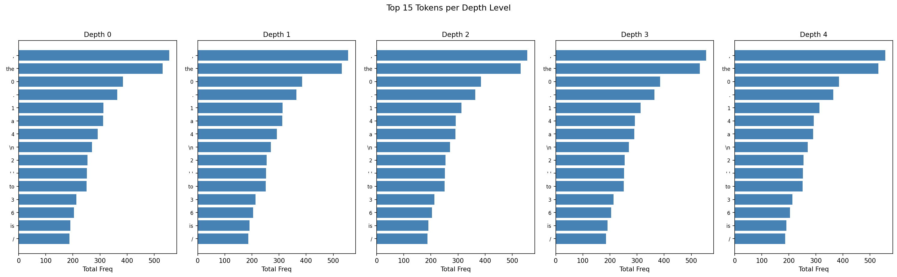

### Depth 0 — Top 10 Tokens

| Token | Token ID | Total Freq |
|-------|----------|------------|
| `,` | 11 | 555 |
| ` the` | 279 | 531 |
| `0` | 15 | 385 |
| `.` | 13 | 364 |
| `1` | 16 | 313 |
| ` a` | 264 | 312 |
| `4` | 19 | 291 |
| `\n` | 198 | 270 |
| `2` | 17 | 254 |
| `' '` | 220 | 252 |

### Depth 1 — Top 10 Tokens

| Token | Token ID | Total Freq |
|-------|----------|------------|
| `,` | 11 | 555 |
| ` the` | 279 | 531 |
| `0` | 15 | 385 |
| `.` | 13 | 364 |
| `1` | 16 | 313 |
| ` a` | 264 | 312 |
| `4` | 19 | 292 |
| `\n` | 198 | 270 |
| `2` | 17 | 254 |
| `' '` | 220 | 252 |

### Depth 2 — Top 10 Tokens

| Token | Token ID | Total Freq |
|-------|----------|------------|
| `,` | 11 | 555 |
| ` the` | 279 | 531 |
| `0` | 15 | 385 |
| `.` | 13 | 364 |
| `1` | 16 | 313 |
| `4` | 19 | 292 |
| ` a` | 264 | 290 |
| `\n` | 198 | 270 |
| `2` | 17 | 254 |
| `' '` | 220 | 252 |

### Depth 3 — Top 10 Tokens

| Token | Token ID | Total Freq |
|-------|----------|------------|
| `,` | 11 | 555 |
| ` the` | 279 | 531 |
| `0` | 15 | 385 |
| `.` | 13 | 364 |
| `1` | 16 | 313 |
| `4` | 19 | 292 |
| ` a` | 264 | 290 |
| `\n` | 198 | 270 |
| `2` | 17 | 254 |
| `' '` | 220 | 252 |

### Depth 4 — Top 10 Tokens

| Token | Token ID | Total Freq |
|-------|----------|------------|
| `,` | 11 | 556 |
| ` the` | 279 | 531 |
| `0` | 15 | 385 |
| `.` | 13 | 364 |
| `1` | 16 | 313 |
| `4` | 19 | 292 |
| ` a` | 264 | 290 |
| `\n` | 198 | 270 |
| `2` | 17 | 254 |
| `' '` | 220 | 252 |

## 4. Token Transition Patterns (Edge Heatmaps)

### Depth 0 → 1

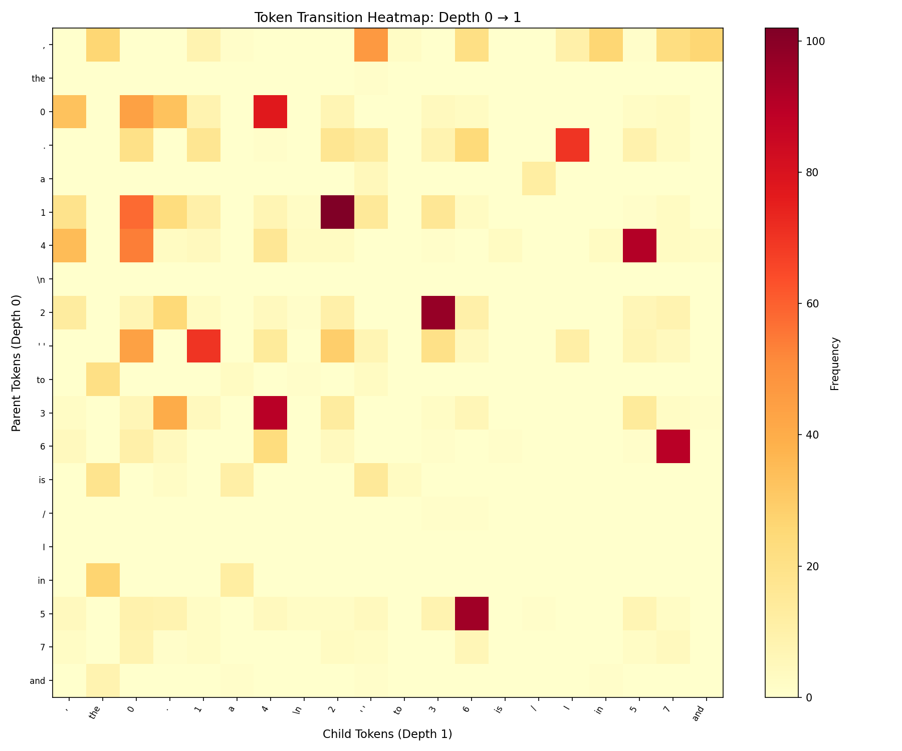

> Top 20 parent × child token pairs by frequency at depth 0→1.

### Depth 1 → 2

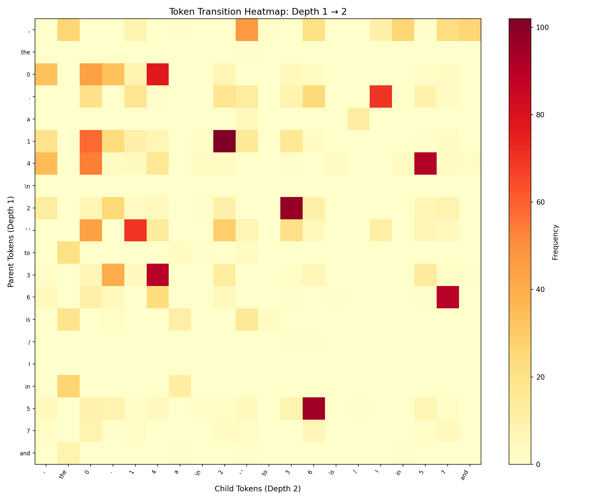

> Top 20 parent × child token pairs by frequency at depth 1→2.

## 5. Sample Subtree Visualizations

> Showing the 3 largest root subtrees (pruned to depth=4, max 5 children per node).
> Node color: lavender=input-dominant, lightyellow=output-dominant.

### Subtree #1

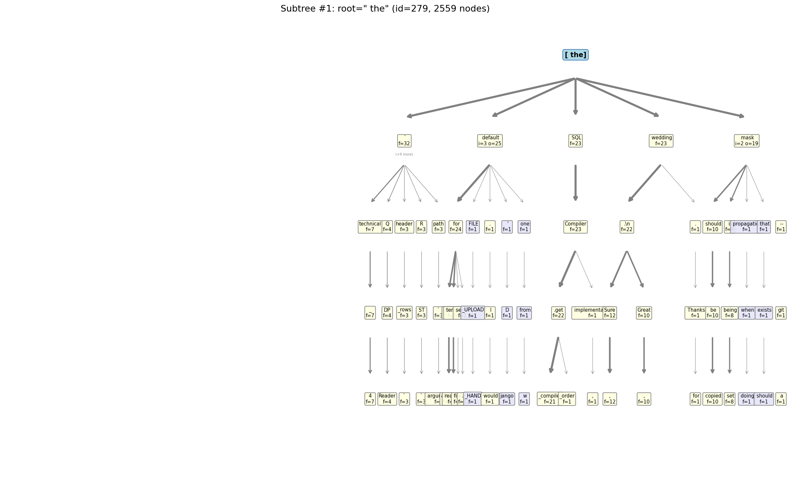

### Subtree #2

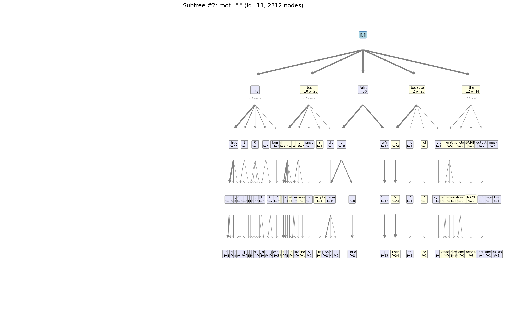

### Subtree #3

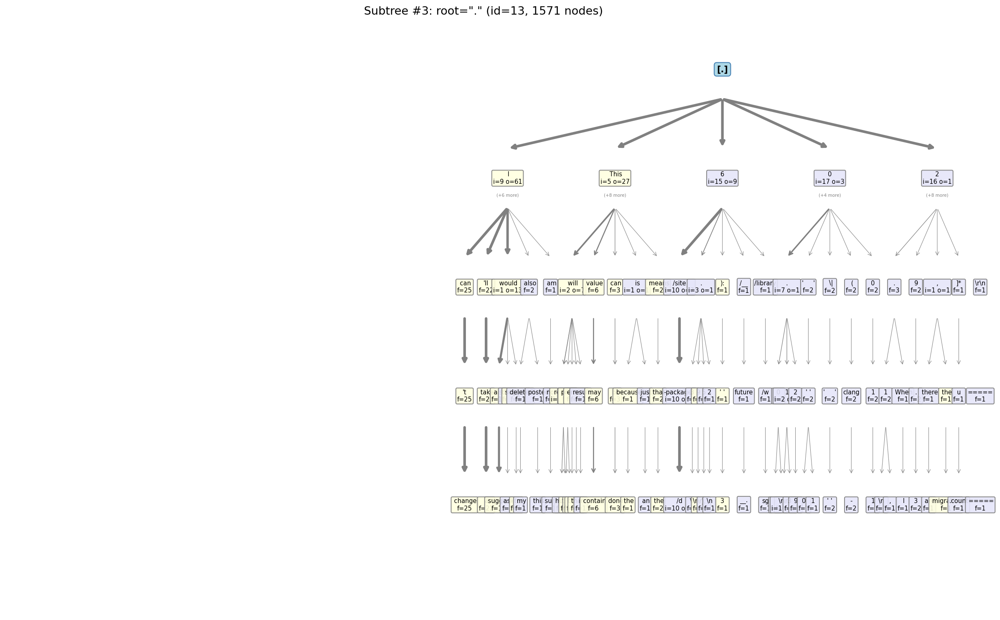

## 6. Key Observations for Design

1. **Root分布不均匀**: 0.7% 的 root 只有 ≤5 个节点，而 13.3% 的 root 有 >50 个节点。少量 hot root 贡献了大部分预测能力。
2. **平均分支因子**: Depth 0 的平均分支因子为 1.35，随深度递减。深层节点趋于单链，说明长序列的共性减少。
3. **Input vs Output 频率**: Depth 0 有 5,365 个 input 条目 vs 3,118 个 output 条目。Input 来自 prompt 扫描，数量远大于 output（生成的 token）。
